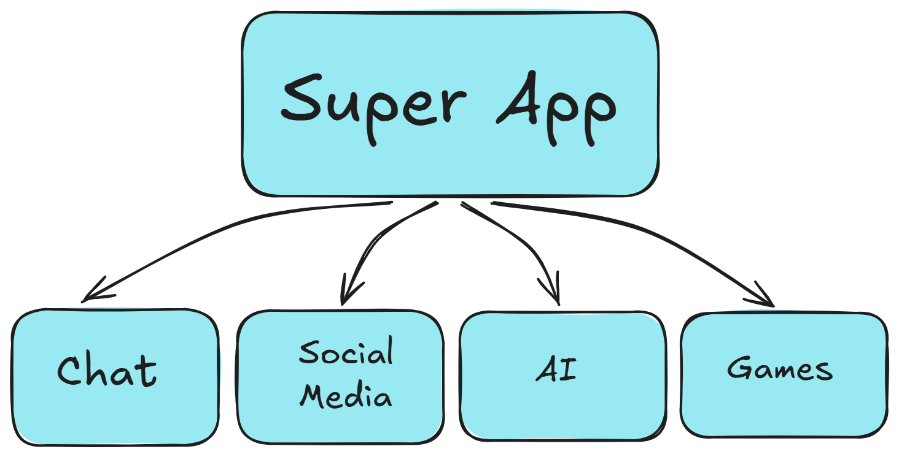

# Super App

## What is the our problem?

We download apps for our needs but why we download different app for different needs. I decided fix this problem.



## Project Structure 

```text
SUPERAPP
|-- backend
|   |-- src
|       |-- assets
|           |-- super_structure.png
|       |-- config
|       |-- core
|           |-- database.py
|       |-- models
|           |-- user.py
|       |-- routers
|           |-- v1
|               |-- auth.py
|           |-- api_v1.py
|       |-- schemas
|           |-- auth.py
|       |-- services
|           |-- auth.py
|       |-- main.py
|   |-- Dockerfile
|   |-- requirements.txt
|-- .env
|-- .env.example
|-- .gitignore
|-- docker-compose.yml
|-- README.md
```

## Features

- Docker & Docker Compose
- PostgreSQL

| **Backend** | **Frontend** |
| ------- | -------- |
| Python (FastAPI) | React (Vite) |

### Deployment

#### Database Information

> Create .env file and write your database information.

#### Setup

```bash
git clone <repo>

cd <repo>

docker compose up --build -d

docker compose up
```

#### Get's to App

> Open the localhost at 5544 port and goes to the Swagger UI.
>
> Click to [localhost](http://localhost:5544/docs)

---

---

---

### Developer

Muhammet Emin OCAK
